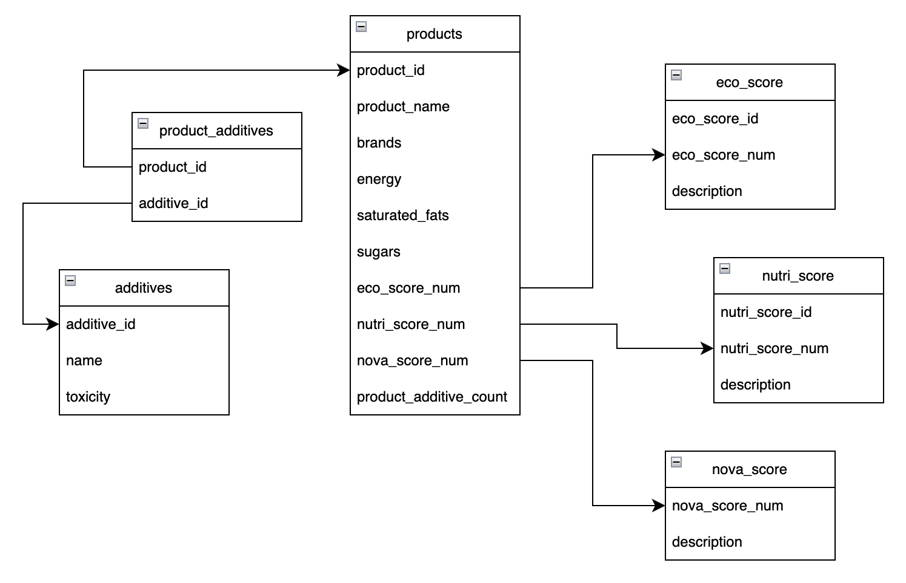
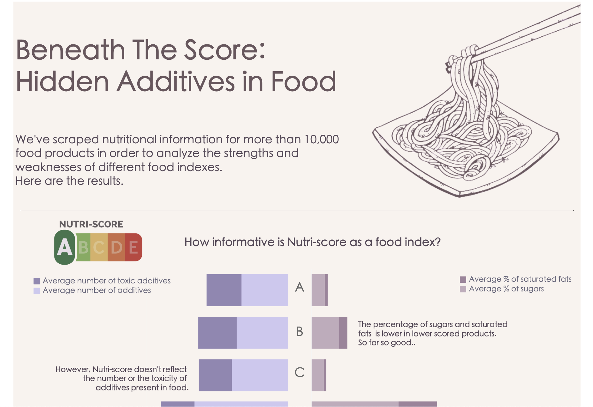

# ETL, analysis and visualization project: Food Advisor


## 1. Project Description

This project aims to analyze the limitations of popular food indexes, such as Nutri-score, and provide relevant information about the contents of the food we eat. We evaluate factors like the number of additives present in food products and the potential harmfulness of these additives to human health.

The project includes the following steps:

- Extracting data via web **scraping**, using Selenium and Beatiful Soup
- **Cleaning, transforming and analysing** the data in jupyer notebooks, using pandas and seaborn.
- Loading clean datasets into **Google Cloud BigQuery** for storage and querying.
- Importing the data from Big Query into **Tableau** using **SQL**.
- **Visualizing** interesting insights in **Tableau**.
- *Next steps*: Preparing the data for text recognition and classification using **Machine Learning** (out of scope for this project).

## 2. Data Extraction via Scraping

The data for this project has been scraped using python scraping libraries Selenium and Beatiful Soup.

### 2.1 [Open Food Facts:](https://es.openfoodfacts.org/)

Open Food Facts contains ingredients, brands and nutritional information about food products sold across the world. We extracted data on 30,000 products commonly available in Spain.  


### 2.2 [Food Additives:](https://www.aditivos-alimentarios.com/)

The Food Additives web includes the name, code, and toxicity information of food additives.


## 3. Data Cleaning, Transformation and Analysis


To ensure the dataset is ready for loading into BigQuery and data analysis, we performed a series of cleaning and transformation steps using the python library pandas:
- loading of the scraped data into DataFrames,
- dropping irrelevant columns,
- renaming columns,
- removing non-numerical characters in float columns,
- performing value imputation to fill null values comprehensively,
- identifying and handling outliers,
- exploring correlations between variables.


Outliers in our data

After completing these steps, the clean data was exported as CSV files for loading into the BigQuery data warehouse.

## 4. Database creation:

For storage and analysis of the data obtained in the previous steps, we decided to use the BigQuery warehouse. The project was made public so others can access this data. Below, you will find a list of tables that have been loaded into BigQuery:

- products
- product_additives
- additives
- eco-score
- nutri-score
- nova-score

Schema diagram of the tables loaded into BigQuery


Public datasets in BigQuery

Click [here](https://console.cloud.google.com/bigquery?hl=es&_ga=2.9595701.1641939318.1694040162-741584245.1693333121&pli=1&project=food-advisor-397909&ws=!1m9!1m4!1m3!1sfood-advisor-397909!2sbquxjob_5a977b_18a6caa937a!3seurope-southwest1!1m3!3m2!1sfood-advisor-397909!2sfood_advisor) to access the public datasets in BigQuery

The next step involved creating a **SQL** query to import the data into Tableau. The query was first created and tested in BigQuery's querying environment. We then used Tableau's custom SQL query option to fetch data from BigQuery:

``` 
SELECT *,
## counting the number of high toxicity additives for each product
COUNTIF(toxicity='high') OVER (PARTITION BY product_id) AS high_toxicity_count
FROM (SELECT
      ## selecting all elements from `products` plus additional fields from the other joined tables 
      p.*,
      nu.nutri_score_id,
      nu.description AS nutri_score_description,
      e.eco_score_id,
      e.description AS eco_score_description,
      n.description AS nova_score_description,
      pa.additive_id,
      a.toxicity
    FROM food_advisor.products p
    LEFT JOIN food_advisor.product_additives pa ## left joinining `product_additives` to access the additives in each product (when available) -- this generates duplicates since often there are more than additives in one product
    ON pa.product_id=p.product_id
    LEFT JOIN food_advisor.additives a ## left joinining `additives` to access information about the additives in each product (when available)
    ON a.additive_id=pa.additive_id
    LEFT JOIN food_advisor.nutri_score nu ## left joinining `nutri_score` to access information about the nutri-score of each product (when available)
    ON nu.nutri_score_num=p.nutri_score_num
    LEFT JOIN food_advisor.eco_score e ## left joinining `eco_score` to access information about the eco-score of each product (when available)
    ON e.eco_score_num=p.eco_score_num
    LEFT JOIN food_advisor.nova_score n ## left joinining `nova_score` to access information about the nova-score of each product (when available)
    ON n.nova_score_num=p.nova_score_num
    ) 
ORDER BY product_id 
```

The result of the query is a table with all the information necessary for visualization. The table contains 18 columns and approximately 33000 rows.

## 5. Visualization & Insights 

We visualized the data using different chart options in Tableau. 

Click here to view the [public dashboard](https://public.tableau.com/app/profile/david.nunez2187/viz/Food_Advisor/Dashboard_V4) and find out what we learned from this project.



## 6. Documents in this repository:

This repository consists of the following documents and folders:

### Data folder
It contains two subfolders:

- Raw: This subfolder contains three raw CSV documents resulting from the scraping process. However, only the "n1_300.csv" file was used for data treatment. This file contains the largest amount of data obtained after a 6-hour scraping process. 

- Clean: This subfolder contains the cleaned CSV files uploaded to BigQuery:
    - products.csv: contains information about the food products and their characteristics (product_id, brands, sugar content, saturated fats content, etc.).
    - product_additives.csv: contains information about the product_id and their additive content.
    - additives.csv: contains information about additives, such as toxicity levels.
    - eco_score: contains information about the Eco-score index.
    - nova_score: contains information about the Nova-score index.
    - nutri_score: contains information about the Nutri-score index.


### Jupyter notebook folder
This folder contains 4 Jupyter notebooks: 
- Web_scraping_additives.ipynb - Provides detailed information about the additives data scraping process.

- Web_scraping_open_food_facts.ipynb - Provides detailed information about the products data scraping process.

- Food_data_treatment.ipynb - Main data analysis Jupyter notebook that covers data cleaning, transformation, and analysis. Each step is explained and the code is commented, offering insights into the decision-making process and the methodology.

- Additional_tables.ipynb - Describes the creation of the 3 tables with additional information on the food indexes (Nutri-score, Nova-score, Eco-score).


### Images folder
This folder contains .png and .jpg files that were used for Tableau visualizations as well as for this readme document.


### Readme
The README file provides a comprehensive overview of the project, including the project description, data extraction, cleaning and analysis. It serves as a guide for readers to understand the project's purpose and the steps involved.


[LinkedIn profile of the author](https://www.linkedin.com/in/david-n%C3%BA%C3%B1ez-pastrana-595ba684/)

