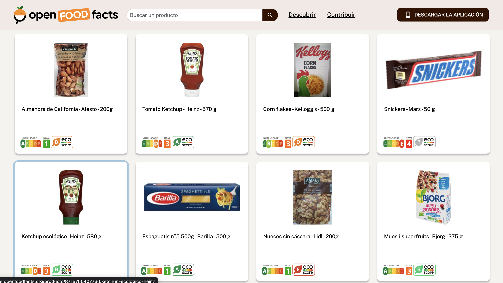
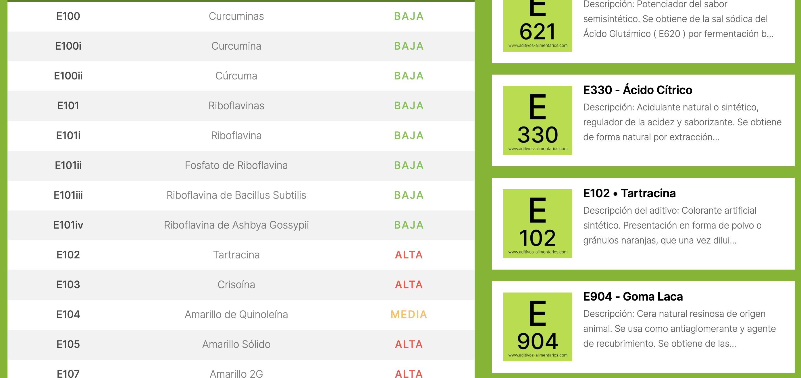
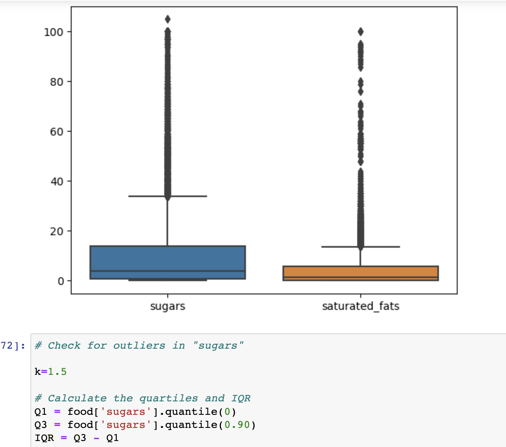
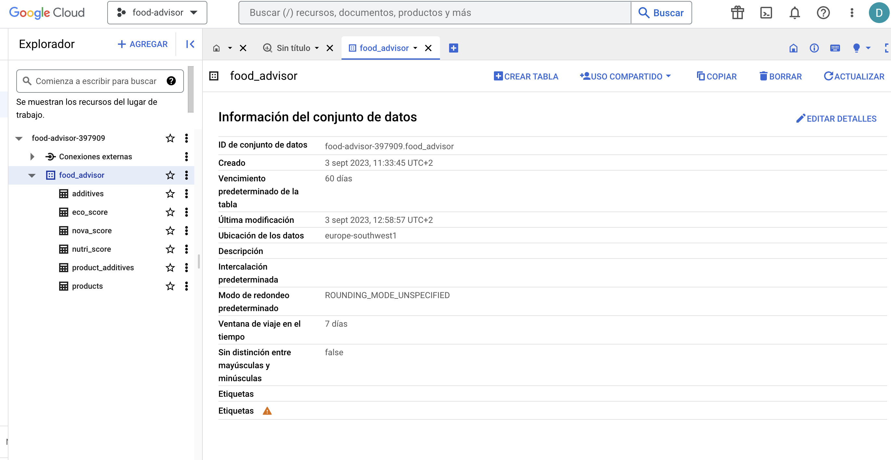

# ETL, analysis and visualization project: Food Advisor


## 1. Project Description

This project aims to analyze the limitations of food indexes, such as the nutri-score, and provide additional information about food products. The goal is to evaluate factors like the number of additives present in the products and the potential harmfulness of these additives to human health.

The project includes the following steps:

- Extracting data through web **scraping** techniques.
- **Transforming** the collected data.
- Loading the data in **BigQuery** warehouse to store the processed data.
- Conducting **data analysis** and obtaining insights.
- **Visualizing** the insights using **Tableau**.
- Preparing the data for text recognition and classification using Machine Learning (not implemented in this project).

## 2. Data Extraction

The data for this project has been extracted usig Web Scraping techniques from various sources of information:

### 2.1 [Open Food Facts:](https://es.openfoodfacts.org/)

Open Food Facts contains information about food products. We used web scraping techniques in Python to extract information from approximately 30,000 products. The raw data after the scraping process is shown here: 




### 2.2 [Food Additives:](https://www.aditivos-alimentarios.com/)

The Food Additives web includes the name, code, and toxicity information of all additives.



## 3. Data Cleaning and Transformation

To ensure the dataset is ready for loading into the "BigQuery" warehouse and subsequent data analysis, the data went through a series of cleaning and transformation steps. The following actions were undertaken to clean and prepare the data:

The scraped information from the mentioned sources was loaded into DataFrames using the Python library "Pandas". The information underwent a comprehensive cleaning process, including tasks such as renaming column names and removing non-numerical characters in float columns. It also underwent transformation procedures such as identifying and handling outliers or performing value imputation to fill null values comprehensively.

Outliers in our data

After completing these steps, the clean data was exported as CSV files in preparation for loading into the BigQuery data warehouse.

## 4. Database creation:

For the storage and analysis of the data obtained in the previous steps, we decided to utilize the BigQuery warehouse:

- Products
- Products additives
- Additives
- Eco-score
- Nutri-score
- Nova-score


BigQuery Warehouse.

Please, click [here](https://console.cloud.google.com/bigquery?hl=es&_ga=2.9595701.1641939318.1694040162-741584245.1693333121&pli=1&project=food-advisor-397909&ws=!1m9!1m4!1m3!1sfood-advisor-397909!2sbquxjob_5a977b_18a6caa937a!3seurope-southwest1!1m3!3m2!1sfood-advisor-397909!2sfood_advisor) to access the data in BigQuery.

The next step involved creating a **SQL** query to prepare the data for visualization in Tableau. The query was tested in BigQuery and then used in Tableau:

``` 
SELECT *,
## counting the number of high toxicity additives for each product
COUNTIF(toxicity='high') OVER (PARTITION BY product_id) AS high_toxicity_count
FROM (SELECT
      ## selecting all elements from `products` plus additional fields from the other joined tables 
      p.*,
      nu.nutri_score_id,
      nu.description AS nutri_score_description,
      e.eco_score_id,
      e.description AS eco_score_description,
      n.description AS nova_score_description,
      pa.additive_id,
      a.toxicity
    FROM food_advisor.products p
    LEFT JOIN food_advisor.product_additives pa ## left joinining `product_additives` to access the additives in each product (when available) -- this generates duplicates since often there are more than additives in one product
    ON pa.product_id=p.product_id
    LEFT JOIN food_advisor.additives a ## left joinining `additives` to access information about the additives in each product (when available)
    ON a.additive_id=pa.additive_id
    LEFT JOIN food_advisor.nutri_score nu ## left joinining `nutri_score` to access information about the nutri-score of each product (when available)
    ON nu.nutri_score_num=p.nutri_score_num
    LEFT JOIN food_advisor.eco_score e ## left joinining `eco_score` to access information about the eco-score of each product (when available)
    ON e.eco_score_num=p.eco_score_num
    LEFT JOIN food_advisor.nova_score n ## left joinining `nova_score` to access information about the nova-score of each product (when available)
    ON n.nova_score_num=p.nova_score_num
    ) 
ORDER BY product_id 
```

The result of the query is a table with all the information necessary for visualization. The table contains 18 columns and approximately 33000 rows.

## 5. Data Analysis

The data was analyzed using Python to see correlations between variables and Tableau to visualize the data and get insgigths from it. 

Please, click here to see the visualization.


Based on the analysis, several conclusions can be drawn:


